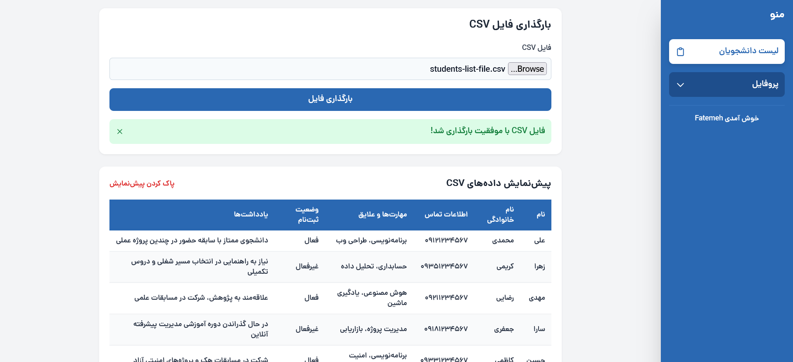
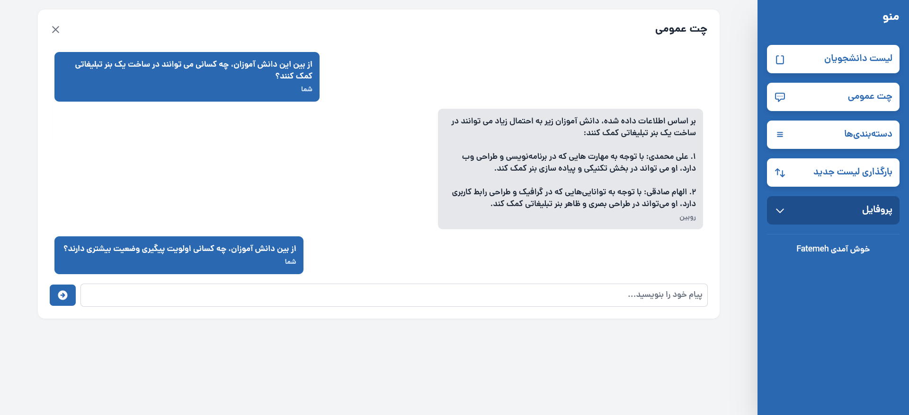
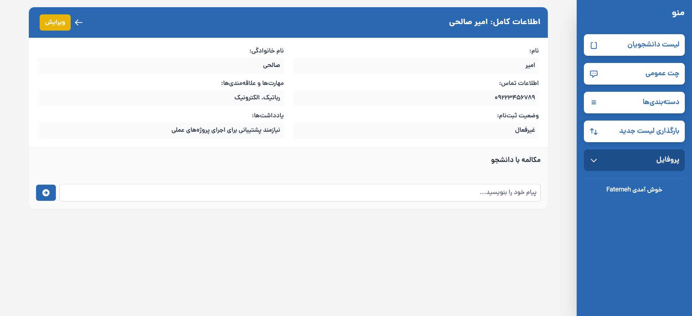
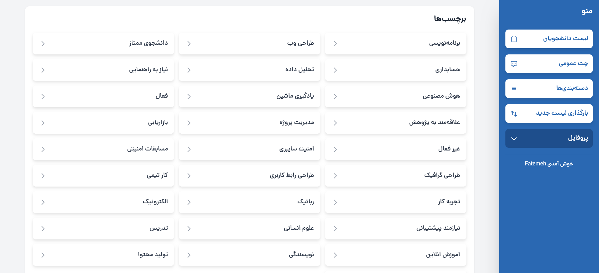

# Rubin – AI-powered Student Management Assistant

Rubin is a smart assistant that helps educational institutions manage student data efficiently. It processes CSV files containing student information, displays structured profiles, generates simple reports, and includes an AI chatbot to answer data-related queries.

---

## Project Overview

Managing large sets of student data manually can be time-consuming and error-prone. Rubin simplifies this process by offering a user-friendly interface for importing CSV files and automatically parsing them into usable profiles. It also features a GPT-powered chatbot that allows staff to ask natural language questions and receive instant insights.

---

## Technologies Used

[](https://laravel.com)  
[](https://laravel-livewire.com)  
[](https://tailwindcss.com)  
[](https://openai.com)  
[](https://sqlite.org)

---

## Features

- Upload and parse student CSV files  
- View structured student profiles with key academic and personal info  
- Auto-generate basic analytics (e.g., grade averages, attendance summaries)  
- AI chatbot to answer questions like "Who has the highest grade in math?"  
- Clean UI with Tailwind + Livewire components  

---

## Project Status

✅ MVP completed  
🚧 Additional features (e.g., export to Excel, advanced filtering) in development  

---

## Screenshots

All screenshots can be found in the [`screenshots`](./screenshots) folder:

|  |  |
|-----------------------------------------|-------------------------------------------|
|  |            |

---

## Getting Started

Follow these steps to run the project locally:

```bash
# 1. Clone the repository
git clone https://github.com/fatemeh-shahrabi/rubin.git
cd rubin

# 2. Install PHP dependencies
composer install

# 3. Install frontend assets
npm install && npm run build

# 4. Copy .env config
cp .env.example .env

# 5. Generate app key
php artisan key:generate

# 6. Create SQLite DB file
touch database/database.sqlite

# 7. Update your .env file:
# DB_CONNECTION=sqlite
# DB_DATABASE=/absolute/path/to/database/database.sqlite

# 8. Run migrations
php artisan migrate

# 9. Link storage (if using file uploads)
php artisan storage:link

# 10. Start dev server
php artisan serve
```

Environment Variables

Make sure to add your OpenAI API key in the .env file

```env
OPENAI_API_KEY="your_openai_api_key_here"
```
